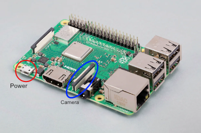
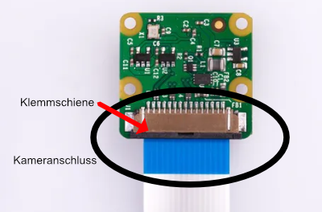
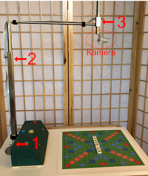

## Installation der Hardware

### Anschlüsse

Raspberry PI (Bild-Quelle: raspberrypi.com)

Da relativ viel Strom für die Anschlüsse verwendet wird, ist ein hinreichend
starkes Netzteil zu verwenden.

Kamera-Anschluss (Bild-Quelle: raspberrypi.com)

Das Flachbandkabel für die Kamera wird in einer Klemmschiene befestigt. 
Hierzu die Klemmschiene vom Anschluss abziehen und das Flachbandkabel 
vorsichtig reinschieben. Beim Flachbandkabel bitte vorher sicherstellen, 
dass die Kontaktstreifen nicht beschädigt oder verboden sind. In diesem 
Fall das Flachbandkabel austauschen.

Die blaue Markierung muss beim Einbau in Richtung Klemmschiene zeigen. 

\pagebreak

### Aufbau des Kamera-Arms

Mit der unteren Inbus Schraube (1; HX5) den Kamera-Arm am Spielbrett befestigen. 
Die mittlere Schraube (2; HX5) kann zur Höheneinstellung verwendet werden. Mit der 
RPI Kamera v1.3 sollte sich die Kamera-Linse ca. 47,5cm über dem Spielbrett 
befinden. Eine Feineinstellung und Rotation der Kamera kann direkt am Kamera-
Halter (3; HX5) vorgenommen werden.

