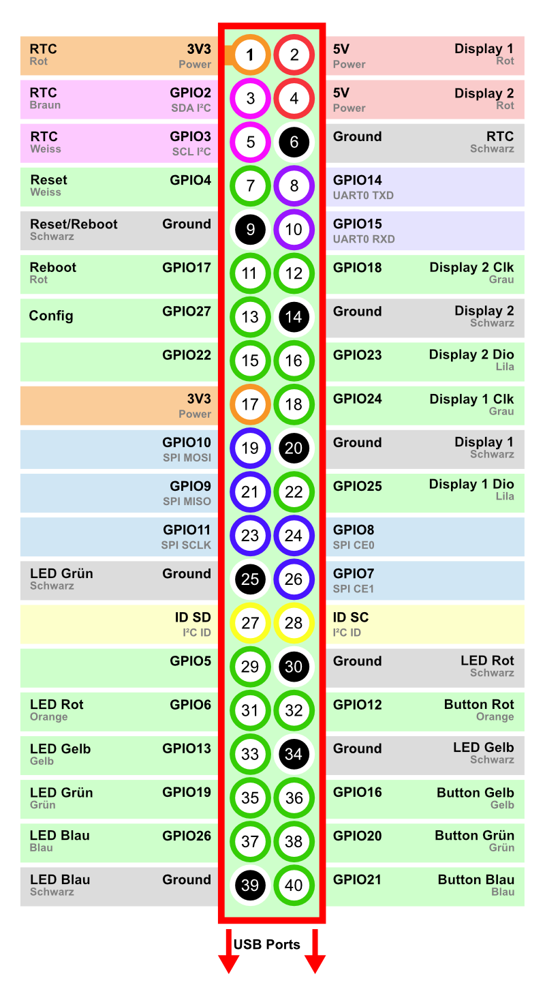
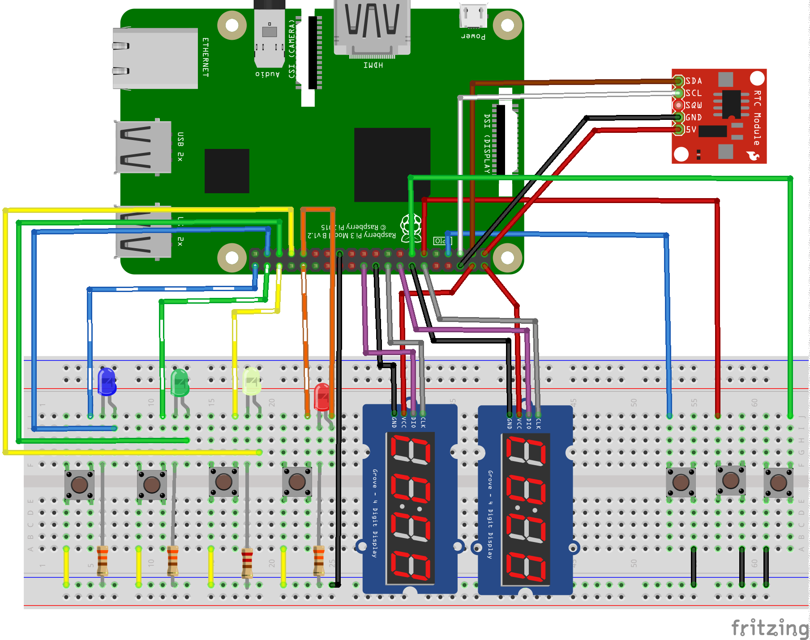
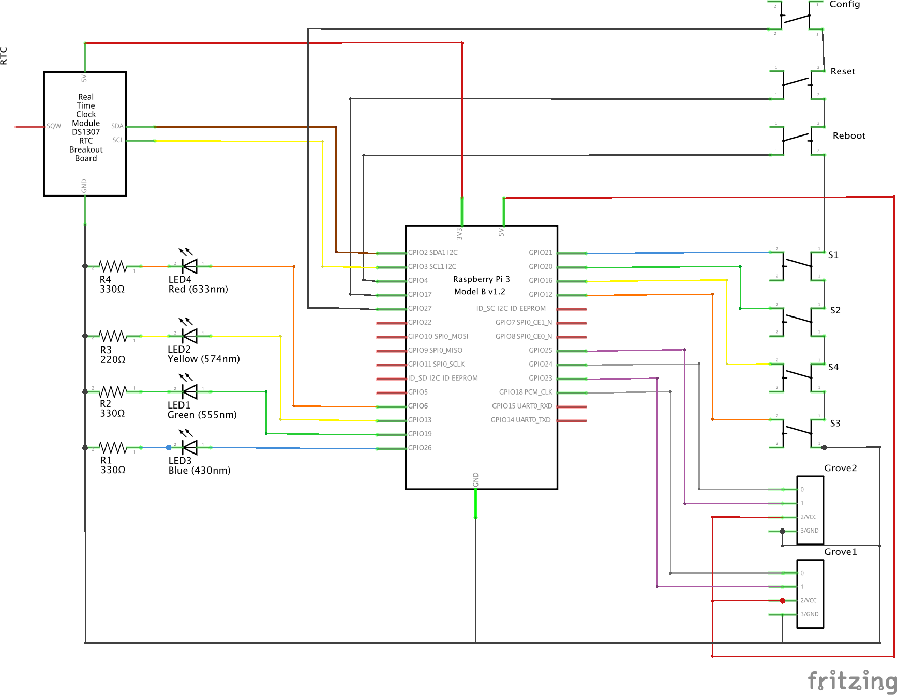

# System-Handbuch

## Technischer Aufbau

### Belegung der PINs / GPIOs

#### RTC

*   3V3 (1)     - (Rot)
*   GPIO2 (3)   - SDA (Braun)
*   GPIO3 (5)   - SCL (Weiss)
*   Ground (6)  - (Schwarz)

#### LEDs

*   GPIO6 (31)  - Rot  (Orange)
*   GPIO13 (33) - Gelb (Gelb)
*   GPIO19 (35) - Grün (Grün)
*   GPIO26 (37) - Blau (Blau)
*   Ground (39) - (Schwarz)

#### Schalter

*   GPIO12 (32) - Rot (Orange)
*   Ground (34) - (Schwarz)
*   GPIO16 (36) - Gelb (Gelb)
*   GPIO20 (38) - Grün (Grün)
*   GPIO21 (40) - Blau (Blau)

### Display

Spieler 1

*   5V (2) - (Rot)
*   GPIO24 (18) - Clk (Grau)
*   Ground (20) - (Schwarz)
*   GPIO25 (22) - Dio (Lila)

Spieler 2

*   5V (4) - (Rot)
*   GPIO18 (12) - Clk (Grau)
*   Ground (14) - (Schwarz)
*   GPIO23 (16) - Dio (Lila)

Reset

*   GPIO4  (7) - (Weiss)
*   Ground (9) - (Schwarz)

Reboot

*   GPI17  (11) - (Rot)
*   Ground (9) - (Braun)

Config

*   GPI27  (13) - (Blau)
*   Ground (9) - (Grün)

### Schaltplan

Ein Versuchsaufbau mittels Breadboard kann wie folgt vorgenommen werden.

Die Grafiken der Schaltpläne sind mit [fritzing](http://fritzing.org/home/)
erstellt worden.

### Kamera

Als Kamera wird eine RPI Camera v1.3 verwendet.
