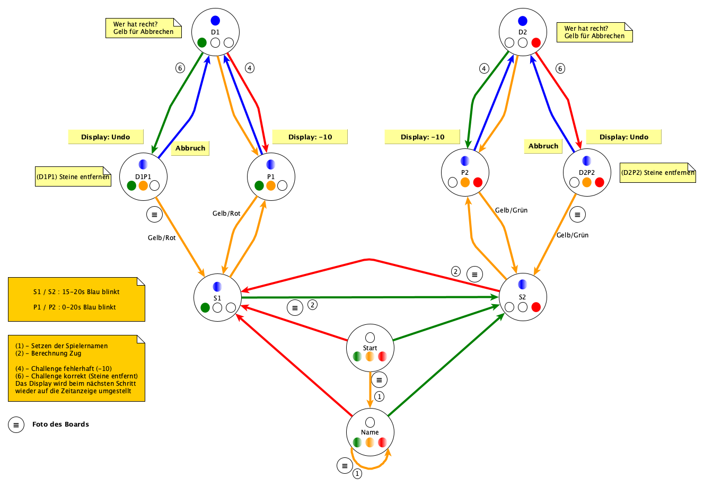

## ScrabScrap - Spieler 1 (Grün)

### Spielzug

 (Zug legen)
 (Grün)

### Pause

 (Gelb)

### Anzweifeln (ich habe Recht)

 (Gelb)
 (Blau)

 (Grün)
 (Zug entfernen)
 (Gelb)

### Anzweifeln (ich habe Unrecht)

 (Gelb)
 (Blau)

 (Rot)
 (Gelb)

### Ich habe nach dem Zug meinen SpielTaster nicht betätigt

Pause -> Steine des Gegners vom Brett entfernen -> Pause -> Grün -> 

Pause -> Steine des Gegners wieder auf das Brett legen -> 

Pause -> Rot -> Grün ist wieder am Zug

Damit verliert der Spieler 1 (Grün) die Bedenkzeit des Gegners

\pagebreak

## ScrabSrap - Spieler 2 (Rot)

### Spielzug

 (Zug legen)
 (Rot)

### Pause

 (Gelb)

### Anzweifeln (ich habe Recht)

 (Gelb)
 (Blau)

 (Rot)
 (Zug entfernen)
 (Gelb)

### Anzweifeln (ich habe Unrecht)

 (Gelb)
 (Blau)

 (Grün)
 (Gelb)

### Ich habe nach dem Zug meinen SpielTaster nicht betätigt

Pause -> Steine des Gegners vom Brett entfernen -> Pause -> Rot -> 

Pause -> Steine des Gegners wieder auf das Brett legen -> 

Pause -> Grün -> Rot ist wieder am Zug

Damit verliert der Spieler 2 (Rot) die Bedenkzeit des Gegners

\pagebreak

# Start eines Spiels

## Ohne Eingabe von Namen

Falls man auf die Eingabe von Namen verzichten will, muss einfach nur der Gegner
das Spiel sterten.

Grün ist in diesem Fall "Spieler 1" und Rot wird als "Spieler 2" geführt.

### Grün soll beginnen

 (Rot)

### Rot soll beginnen

 (Grün)

## Mit Eingabe der Spielernamen

### Vorbereitung

Das Mittelfeld muss mit einem Blank belegt werden. Auf das Spielfeld müssen 
in der Zeile 8 angrenzend an den Mittelstein die Spielernamen gelegt werden.
In den Spalten A-G legt der Spieler "Grün" seinen Namen und in den Spalten 
I-O legt der Spieler "Rot" seinen Namen.

### Einlesen der Spielernamen

 (Gelb)

Im Display werden die ersten vier Zeichen der erkannten Spielernamen angezeigt. 
Sind diese nicht korrekt, kann durch Drücken des gelben Buttons das Einlesen 
wiederholt werden. Sollten die Spielernamen wiederholt nicht korrekt erkannt 
werden, deutet das auf eine fehlerhafte Justinierung der Kamera hin.

Danach kann der Gegner das Spiel starten.

### Grün soll beginnen

 (Rot)

### Rot soll beginnen

 (Grün)

# Ende des Spiels

Zunächst sicherstellen, dass das Spiel pausiert ist. Also die gelbe LED blinkt.
Um ein Spiel zu beenden und zu arichivieren, muss der **schwarze Taster** an der
Seite für mehr als 3 Sekunden gedrückt und dann wieder losgelassen werden.

Die Anzeige wird dann zurückgesetzt und es blinken wieder alle LEDs.

_Hinweis:_ es kann einen Augenblick dauern, da hier zunächst das gesamte Spiel
inklusive aller Bilder in einer ZIP-Datei gespeichert wird. Diese wird dann
zusätzlich auf den Web-Server hochgeladen. 

# Der Rechner reagiert nicht mehr

Falls der Rechner nicht mehr auf das Drücken der farbigen Schaltflächen
reagiert, oder die Displays über mehrere Züge keine korrekte Zeit mehr 
anzeigen, ist vermutlich ein Software-Fehler aufgetreten.
In diesem Fall kann der gesamte Rechner durch Drücken des **roten Tasters**
an der Seite des Kastens für mehr als 3 Sekunden neu gestartet werden.

_Hinweis:_ in diesem Fall gehen alle nicht gespeichterten Daten verloren und
das aktuelle Spiel kann nicht mehr fortgesetzt werden.

\pagebreak

# Quick-Reference - ScrabScrap

## Grundsätzliche Vorbemerkung

Die Anwendung beruht darauf, zu bestimmten Zeitpunkten ein Foto vom
Spielbrett aufzunehmen und dann zu analysieren. Damit dies möglichst
fehlerfrei funktioniert, müssen die Spieler darauf achten, das Brett 
nicht zu verdecken, wenn der Taster zum Auslösen des Spielzuges
gedrückt wird.

## Was bedeuten die leuchtenden und blinkenden LEDs?

### Grün leuchtet (Blau blinkt)

Spieler 1 ist am Zug und seine Stoppuhr läuft. Sofern sein Zug 
vollständig auf das Brett gelegt wurde, muss der grüne Taster gedrückt 
werden. Die Stoppuhr des Spielers wird angehalten und die des Gegners 
läuft los. Es wird eine Analyse des Brettes vorgenommen und Spieler 2 
(Rot) ist am Zug. 

Falls nur noch 5 Sekunden für das Anzweifeln verfügbar sind, blinkt die
blaue LED.

_Foto beim Drücken von Grün._

### Rot leuchtet (Blau blinkt)

Spieler 2 ist am Zug und seine Stoppuhr läuft. Sofern sein Zug 
vollständig auf das Brett gelegt wurde, muss der rote Taster gedrückt 
werden.  Die Stoppuhr des Spielers wird angehalten und die des Gegners 
läuft los. Es wird eine Analyse des Brettes vorgenommen und Spieler 1 
(Grün) ist am Zug.

Falls nur noch 5 Sekunden für das Anzweifeln verfügbar sind, blinkt die
blaue LED.

_Foto beim Drücken von Rot_

### Gelb, Grün leuchten (Blau blinkt)

Spieler 1 ist am Zug, aber das Spiel ist pausiert (die Zeit läuft nicht 
weiter). Sofern das Spiel weiterlaufen soll, kann der gelbe oder der 
rote Taster (Spielknopf des Gegners) gedrückt werden. 

Falls ein Anzweifeln des gegnerischen Zuges möglich ist, blinkt die 
blaue LED. In diesem Fall kann der Zug  des Gegners (Spieler 2, Rot) 
angezweifelt werden, indem der blaue Taster gedrückt wird.

Wird im Display "undo" angezeigt, wird gerade ein "korrektes Anzweifeln"
ausgeführt. In diesem Zustand muss der Zug von dem Brett entfernt werden.
Das Spiel wird dann durch Drücken des gelben Tasters (_Foto_) fortgeführt. 

Falls das "korrekte Anzweifeln" versehentlich ausgelöst wurde, kann durch
Drücken des blauen Tasters der Zustand abgebrochen werden. Danach befindet
sich das System in dem Zustand "Anzweifeln".

### Gelb, Rot leuchten (Blau blinkt)

Spieler 2 ist am Zug, aber das Spiel ist pausiert (die Zeit läuft nicht 
weiter). Sofern das Spiel weiterlaufen soll, kann der gelbe oder der 
grüne Taster (Spielknopf des Gegners) gedrückt werden. 

Falls ein Anzweifeln des gegnerischen Zuges möglich ist, blinkt die 
blaue LED. In diesem Fall kann der Zug  des Gegners (Spieler 1, Grün) 
angezweifelt werden, indem der blaue Taster gedrückt wird.

Wird im Display "undo" angezeigt, wird gerade ein "korrektes Anzweifeln"
ausgeführt. In diesem Zustand muss der Zug von dem Brett entfernt werden.
Das Spiel wird dann durch Drücken des gelben Tasters (_Foto_) fortgeführt.

Falls das "korrekte Anzweifeln" versehentlich ausgelöst wurde, kann durch
Drücken des blauen Tasters der Zustand abgebrochen werden. Danach befindet
sich das System in dem Zustand "Anzweifeln".

### (Grün, Gelb, Rot) blinken

Start des Spiels. Blinkt zu der roten und grünen LED noch die gelbe LED,
dann besteht - optional - die Möglichkeit die Namen der Spieler auf das 
Brett zu legen. Der Mittelpunkt des Brettes muss mit einem Blank 
besetzt werden. Links davon wird der Name von Spieler 1 (Grün) und 
rechts davon der Name von Spieler 2 (Rot) gelegt. Liegen die Namen 
korrekt, muss der gelbe Taster gedrückt werden (_Foto_). 

Sofern keine Spieler-Namen gelegt werden oder die Namen korrekt erfasst
wurden, kann der Gegner das Spiel starten. Wenn also der "grüne" Spieler 
beginnen soll, drückt der "rote" Spieler seinen Knopf und umgekehrt.

### Grün, Blau leuchten

Ein im Zug des Spielers 2 (Rot) gelegtes Wort wird von dem Spieler 1 
(Grün) angezweifelt. Nach Prüfung des Wortes sind folgende Aktionen
möglich:

*   Drücken des gelben Tasters: das Anzweifeln wird abgebrochen und es 
wird in die Spiel-Pause gewechselt.
*   Drücken des roten Tasters: das Anzweifeln durch Spieler 1 
erfolgte zu Unrecht (d.h. das angezweifelte, von Spieler 2 gelegte Wort 
war korrekt). Spieler 1 (Grün) erhält sofort beim Drücken 10 Strafpunkte 
und es wird in die Spiel-Pause gewechselt. Von dort wäre ein weiteres 
Anzweifeln für ein weiteres Wort möglich.
*   Drücken des grünen Tasters: Spieler 1 hat mit dem Anzweifeln recht 
(d.h. es ist ein falsches Wort gelegt worden). Im Display wird dann 
"undo" angezeigt. Die Steine müssen vom dann Brett entfernt werden 
und im Anschluss der gelbe Taster gedrückt werden.

_Hinweis:_ Werden mehrere Wörter angezweifelt, muss für jedes 
Anzweifeln der Prozess "blauer Taster" -> "roter/grüner Taster" 
wiederholt werden.

_Hinweis:_ Das korrekte Anzweifeln muss immer als letztes ausgeführt
werden, da nach dem Entfernen der inkorrekten Steine und Drücken des
gelben Tasters das Spiel fortgesetzt wird.

### Rot, Blau leuchten

Der Zug des Spielers 1 (Grün) wird von dem Spieler 2 (Rot) angezweifelt. 
Nach Prüfung des Brettes sind folgende Aktionen möglich:

*   Drücken des gelben Tasters: das Anzweifeln wird abgebrochen und es 
wird in die Spiel-Pause gewechselt.
*   Drücken des grünen Tasters: das Anzweifeln durch Spieler 2 
erfolgte zu Unrecht (d.h. das angezweifelte, von Spieler 1 gelegte Wort 
war korrekt). Spieler 2 (Rot) erhält sofort beim Drücken 10 Strafpunkte 
und es wird in die Spiel-Pause gewechselt. Von dort wäre ein weiteres 
Anzweifeln für ein weiteres Wort möglich.
*   Drücken des roten Tasters: Spieler 2 hat mit dem Anzweifeln recht 
(d.h. es ist ein falsches Wort gelegt worden). Im Display wird dann 
"undo" angezeigt. Die Steine müssen vom dann Brett entfernt werden 
und im Anschluss der gelbe Taster gedrückt werden.

_Hinweis:_ Werden mehrere Wörter angezweifelt, muss für jedes 
Anzweifeln der Prozess "blauer Taster" -> "grüner/roter Taster" 
wiederholt werden.

_Hinweis:_ Das korrekte Anzweifeln muss immer als letztes ausgeführt
werden, da nach dem Entfernen der inkorrekten Steine und Drücken des
gelben Tasters das Spiel fortgesetzt wird.

## Weitere Taster

Am Schaltkasten befinden sich an der Seite drei kleine Taster. Mit diesen
kann die Anwendung bzw. der Rechner neu gestartet werden.

### Taster Schwarz

Mit diesem Taster (länger als 3 Sekunden gedrückt halten) wird ein Reset der
Anwendung ausgelöst. D.h. die Anwendung startet neu.

_Hinweis:_ Diese Funktion kann nur genutzt werden, wenn "Pause" aktiv ist. D.h.
die Kontrollleuchte Gelb muss entweder dauerleuchten oder blinken.

_Hinweis:_ Der aktuelle Stand des Spieles geht verloren und das Spiel
startet neu.

### Taster Rot

Mit diesem Taster (länger als 3 Sekunden gedrückt halten) wird der Rechner
heruntergefahren oder neu gestartet, je nach Einstellung (Konfiguration in der scrabble.ini).

_Hinweis:_ Diese Funktion kann nur genutzt werden, wenn "Pause" aktiv ist. D.h.
die Kontrollleuchte Gelb muss entweder dauerleuchten oder blinken.

_Hinweis:_ Der aktuelle Stand des Spieles geht verloren und der Rechner
startet neu.

### Taster Blau

Mit diesem Taster (länger als 3 Sekunden gedrückt halten) wird die Konfigurationsanwendung gestartet. Hierzu wird der HotSpot "ScrabbleHotspot" gestartet.

Danach mit dem HotSport verbinden (Default-Passwort: "scrabble") und
mit dem Browser die URL http://10.0.0.5:8080 aufrufen.

_Hinweis:_ Diese Funktion kann nur genutzt werden, wenn "Pause" aktiv ist. D.h.
die Kontrollleuchte Gelb muss entweder dauerleuchten oder blinken.

_Hinweis:_ Der aktuelle Stand des Spieles geht verloren und der Rechner
startet neu.

## Allgemeine Hinweise

Die Anwendung ist so konzipiert, dass sie auch im Fehlerfall 
weiterläuft. Es werden nur die nicht funktionierenden Teile der 
Anwendung deaktiviert. Das hat aber zur Folge, dass abhängige Teile 
ebenfalls nicht mehr korrekt funktionieren. So kann natürlich keine 
Berechnung des Brettes vorgenommen werden, wenn die Kamera keine 
korrekten Bilder mehr aufnehmen kann.

## Zustandsdiagramm

